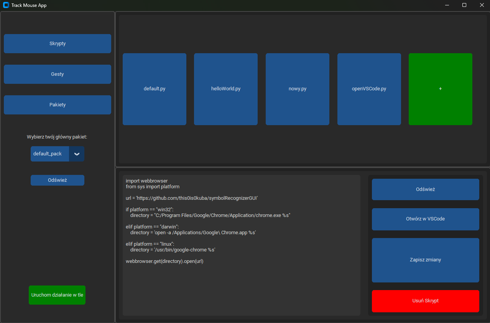
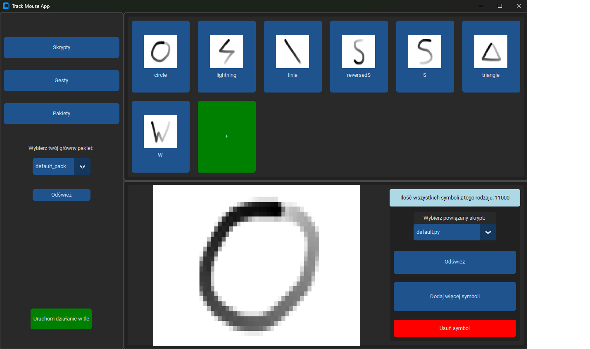
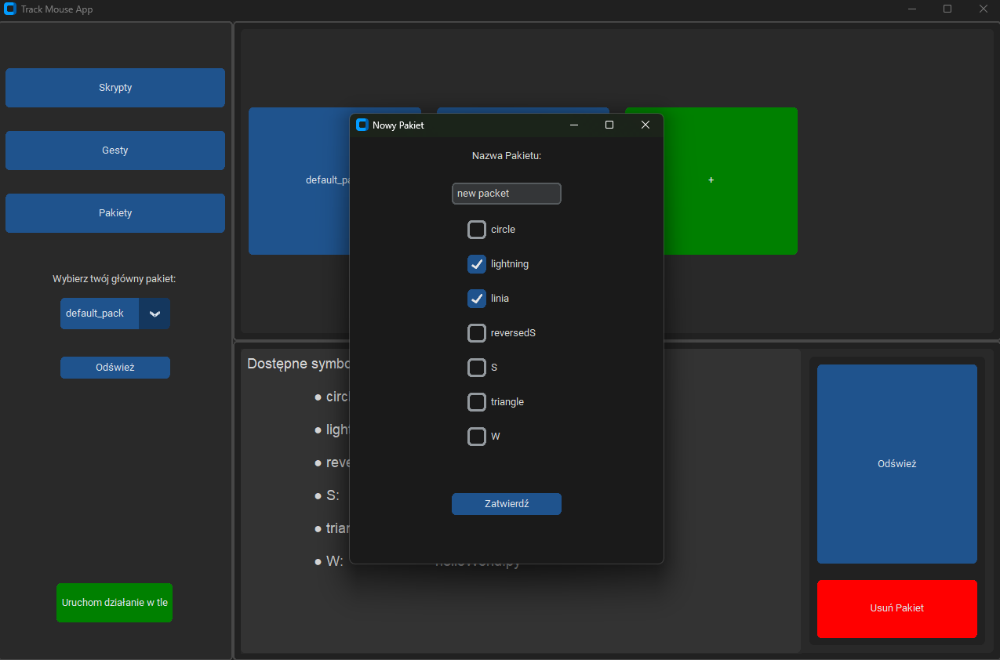
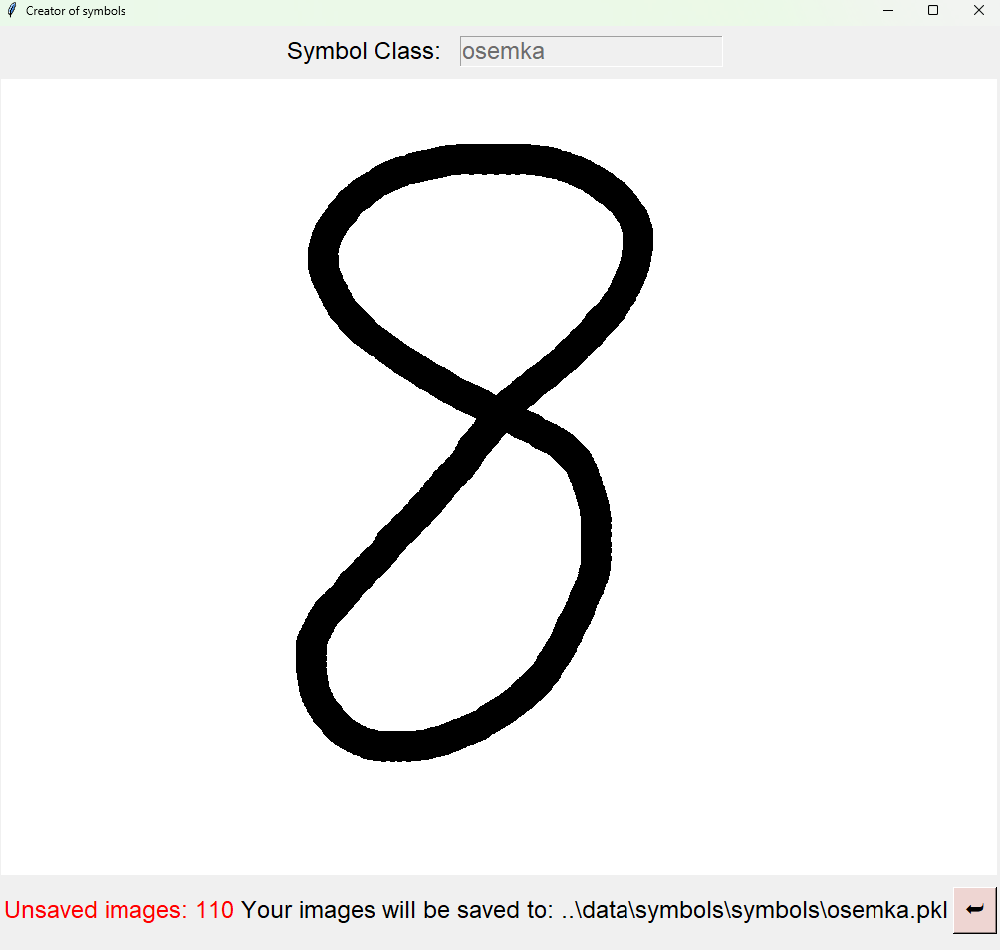

# SymbolRecognizerGUI
Desktop application which allows users to create assosiated symbols with their scripts.

## Description
Using mouse user can draw a symbol on the screen and program analize the symbol using neural netowrk. Then it predicts what kind of symbol it is and it runs the assosiated script.
Ther is a GUI which allows users easly create new symbols, scripts and packs (groups of symbols). The pack has its own neural netowrk which is accitvated after run monitoring the mouse coursor.
User can create new pack and neural netowrks by selecting the appropriate symbols. You can check the full documentation [here](documentaion.pdf).

## GUI

### There are three tabs: scripts, symbols and packets

   
   
  

### New Packet tab

### Tool to create new data (symbols images).
Images are used to learn the neural netowrk. After each release the button the symbol is added with its 10 similar versions. The similar versions are the same imamge but there are rotated and scaled.
This process helps the user quickly create new data because 11 of them are added each time you release the mouse.

