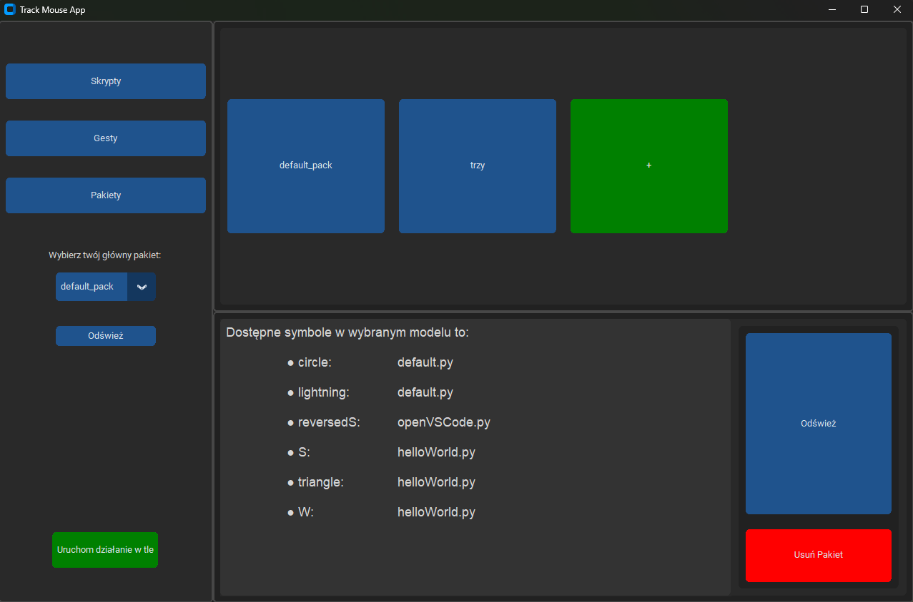

# SymbolRecognizerGUI
Desktop application which allows users to create symbols assosiated with their scripts.

## Description
Using mouse user can draw a symbol on the screen and program analizes the symbol using neural netowork. Then it predicts what kind of symbol it is and it runs the assosiated script.
There is a GUI which allows users easly create new symbols, scripts and packages (groups of symbols). The package has its own neural netowrk which is activated after running mouse coursor monitoring.
User can create new package and neural netowrks by selecting the appropriate symbols. You can check the full documentation [here](documentation.pdf).

## GUI

### There are three tabs: scripts, symbols and packages

|                                           |                                            |                                          |
| ----------------------------------------- |--------------------------------------------|------------------------------------------|
|  |   |  |

### New Package tab

### Tool to create new data (symbol images).
Images are used to train the neural netowrk. After each release of button the symbol is added with its 10 similar versions. The similar versions are the same image but there are rotated and scaled.
This process helps the user quickly create new data because 11 of them are added each time you release the mouse.

